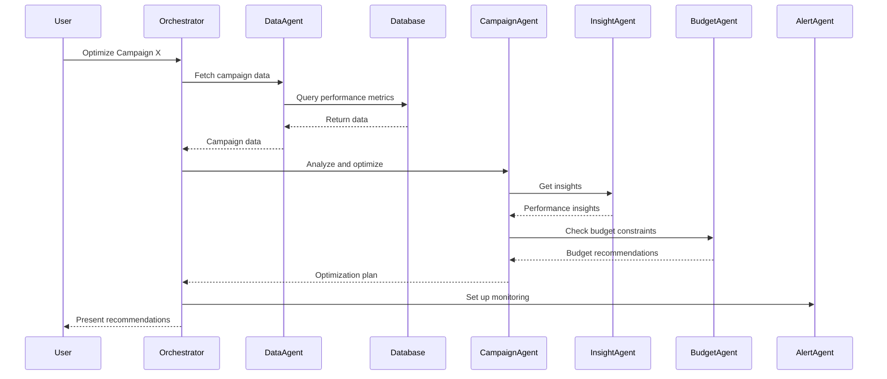
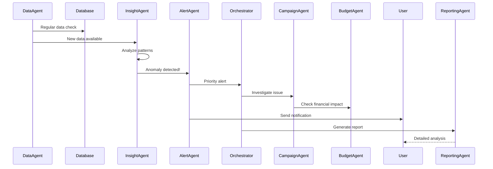

# MarketingIQ Multi-Agent System Architecture

## 1. Current System Overview

### 1.1 Existing API Endpoints

| Endpoint | Method | Description | Data Access |
|----------|--------|-------------|-------------|
| **Campaign Management** |
| `/campaigns` | GET | List all campaigns with performance metrics | DimCampaign + FactCampaignPerformance |
| `/campaigns/{id}` | GET | Get specific campaign details | DimCampaign + Aggregated metrics |
| `/campaigns/{id}/performance` | GET | Time-series performance data | FactCampaignPerformance + DimDate |
| **Ad Group Management** |
| `/ad-groups` | GET | List ad groups with filtering | DimAdGroup + FactAdGroupPerformance |
| `/ad-groups/{id}` | GET | Get specific ad group details | DimAdGroup + Performance metrics |
| **Keyword Management** |
| `/keywords` | GET | List keywords with quality scores | DimKeyword + FactKeywordPerformance |
| `/keywords/performance` | GET | Keyword performance metrics | FactKeywordPerformance |
| **Analytics & Metrics** |
| `/metrics/summary` | GET | Overall account performance summary | Aggregated facts across all tables |
| `/metrics/trends` | GET | Time-series trends for metrics | FactTables + DimDate with grouping |
| **System** |
| `/health` | GET | Database connection health check | Connection status |
| `/` | GET | API documentation | Static endpoint list |

### 1.2 Data Access Layer

#### Database Schema
```
Schema: dw (Data Warehouse)

Dimension Tables:
- DimCampaign (Campaign master data)
- DimAdGroup (Ad group hierarchy)
- DimKeyword (Keyword attributes)
- DimDate (Time dimension)

Fact Tables:
- FactCampaignPerformance (Daily campaign metrics)
- FactAdGroupPerformance (Daily ad group metrics)
- FactKeywordPerformance (Daily keyword metrics)
```

#### ETL Pipeline Components
- **Google Ads API Integration**: Direct API access for data extraction
- **Data Transformation**: Pandas-based processing
- **SQL Server Loading**: Bulk insert operations
- **Incremental Updates**: Last 30 days rolling window

## 2. Proposed Multi-Agent Architecture

### 2.1 Agent Hierarchy

```
┌─────────────────────────────────────────────────┐
│           Orchestrator Agent                    │
│         (Central Coordination)                  │
└──────────┬──────────────────────────────────────┘
           │
    ┌──────┴──────┬────────┬────────┬────────────┐
    │             │        │        │            │
┌───▼───┐ ┌──────▼──┐ ┌───▼───┐ ┌─▼──────┐ ┌───▼────┐
│Data   │ │Campaign │ │Insight│ │Budget  │ │Alert   │
│Agent  │ │Agent    │ │Agent  │ │Agent   │ │Agent   │
└───┬───┘ └────┬────┘ └───┬───┘ └───┬────┘ └───┬────┘
    │          │          │         │          │
┌───▼──────────▼──────────▼─────────▼──────────▼────┐
│           Shared Knowledge Base                    │
│         (Redis/PostgreSQL/Vector DB)               │
└────────────────────────────────────────────────────┘
```

### 2.2 Agent Specifications

#### **1. Orchestrator Agent**
**Purpose**: Central coordinator for all agent activities
**Capabilities**:
- Task distribution and prioritization
- Agent communication management
- Conflict resolution
- User interface handling
- Response aggregation

**Technologies**:
- LangChain for orchestration
- FastAPI for API endpoints
- Redis for message queue

---

#### **2. Data Extraction Agent**
**Purpose**: Handle all data retrieval and ETL operations
**Capabilities**:
- Google Ads API data extraction
- Database query optimization
- Real-time data streaming
- Data validation and cleaning
- Incremental data updates

**Access Points**:
- Google Ads API (via google-ads-python)
- SQL Server (all dw schema tables)
- External data sources (competitor APIs)

**Key Methods**:
```python
- extract_campaign_data()
- extract_keyword_performance()
- validate_data_quality()
- handle_api_limits()
- manage_data_freshness()
```

---

#### **3. Campaign Optimization Agent**
**Purpose**: Optimize campaign performance and bidding strategies
**Capabilities**:
- Bid adjustment recommendations
- Budget allocation optimization
- A/B testing management
- Performance forecasting
- Campaign structure recommendations

**ML Models**:
- Time series forecasting (Prophet/ARIMA)
- Bid optimization (Reinforcement Learning)
- Budget allocation (Linear Programming)

**Decision Framework**:
```python
- analyze_campaign_performance()
- recommend_bid_adjustments()
- optimize_budget_distribution()
- predict_campaign_outcomes()
- generate_optimization_plan()
```

---

#### **4. Insight Generation Agent**
**Purpose**: Generate actionable insights from data patterns
**Capabilities**:
- Anomaly detection
- Trend analysis
- Competitive analysis
- Customer behavior patterns
- Performance attribution

**Analytics Stack**:
- Pandas for data manipulation
- Scikit-learn for ML models
- Plotly for visualizations
- OpenAI GPT for natural language insights

**Analysis Methods**:
```python
- detect_performance_anomalies()
- analyze_conversion_patterns()
- identify_growth_opportunities()
- generate_executive_summary()
- create_visual_reports()
```

---

#### **5. Budget Management Agent**
**Purpose**: Monitor and optimize budget utilization
**Capabilities**:
- Budget pacing analysis
- Overspend prevention
- ROI optimization
- Budget reallocation suggestions
- Cost forecasting

**Financial Models**:
- Budget pacing algorithms
- ROI prediction models
- Cost-per-acquisition optimization

**Control Functions**:
```python
- monitor_budget_utilization()
- predict_monthly_spend()
- recommend_budget_shifts()
- calculate_roi_metrics()
- alert_budget_anomalies()
```

---

#### **6. Alert & Monitoring Agent**
**Purpose**: Real-time monitoring and alerting system
**Capabilities**:
- Performance threshold monitoring
- Anomaly detection alerts
- Competitive movement alerts
- API status monitoring
- Custom alert rules

**Notification Channels**:
- Email (SMTP)
- Slack integration
- SMS (Twilio)
- In-app notifications
- Webhook triggers

**Alert Types**:
```python
- performance_degradation_alert()
- budget_overspend_warning()
- quality_score_drop_alert()
- competitor_activity_notification()
- api_failure_alert()
```

---

#### **7. Keyword Research Agent**
**Purpose**: Discover and analyze keyword opportunities
**Capabilities**:
- New keyword discovery
- Search term analysis
- Negative keyword recommendations
- Keyword grouping
- Competition analysis

**Data Sources**:
- Google Ads Keyword Planner
- Search term reports
- Competitor analysis tools
- Google Trends API

**Research Functions**:
```python
- discover_new_keywords()
- analyze_search_terms()
- identify_negative_keywords()
- group_similar_keywords()
- assess_keyword_competition()
```

---

#### **8. Reporting Agent**
**Purpose**: Generate comprehensive reports and dashboards
**Capabilities**:
- Automated report generation
- Custom dashboard creation
- Export to multiple formats
- Scheduled reporting
- Interactive visualizations

**Output Formats**:
- PDF reports
- Excel spreadsheets
- PowerBI integration
- Tableau dashboards
- Email summaries

**Report Types**:
```python
- generate_performance_report()
- create_executive_dashboard()
- export_detailed_analytics()
- schedule_recurring_reports()
- build_custom_visualization()
```

## 3. Implementation Architecture

### 3.1 Technology Stack

```yaml
Core Framework:
  - Python 3.10+
  - FastAPI (API layer)
  - LangChain (Agent orchestration)
  - OpenAI GPT-4 (NLP capabilities)

Data Layer:
  - SQL Server (Primary data warehouse)
  - Redis (Message queue & caching)
  - ChromaDB/Pinecone (Vector storage)
  - MongoDB (Document store for logs)

ML/AI Stack:
  - Scikit-learn (Traditional ML)
  - TensorFlow/PyTorch (Deep learning)
  - Prophet (Time series)
  - Optuna (Hyperparameter tuning)

Infrastructure:
  - Docker (Containerization)
  - Kubernetes (Orchestration)
  - Apache Airflow (Workflow management)
  - Grafana (Monitoring)
```

### 3.2 Communication Protocol

```python
# Agent Communication Interface
class AgentMessage:
    sender: str          # Agent identifier
    receiver: str        # Target agent or "broadcast"
    message_type: str    # request/response/notification
    payload: dict        # Message content
    priority: int        # 1-5 (5 being highest)
    timestamp: datetime
    correlation_id: str  # For tracking conversations
```

### 3.3 API Extension for Multi-Agent System

```python
# New API Endpoints for Agent System
POST   /agents/task                 # Submit task to agent system
GET    /agents/status/{task_id}     # Get task execution status
POST   /agents/{agent_name}/invoke  # Direct agent invocation
GET    /agents/available            # List available agents
POST   /agents/collaborate          # Multi-agent collaboration request

# WebSocket Endpoints for Real-time
WS     /agents/stream              # Real-time agent updates
WS     /agents/chat                # Interactive agent chat
```

## 4. Agent Interaction Workflows

### 4.1 Campaign Optimization Workflow



### 4.2 Anomaly Detection Workflow



## 5. Data Flow Architecture

### 5.1 Real-time Data Pipeline

```
Google Ads API → Kafka/Redis Stream → Data Agent → SQL Server
                                   ↓
                            Transformation Layer
                                   ↓
                          Agent Knowledge Base
                                   ↓
                        [Multiple Agents Access]
```

### 5.2 Knowledge Base Structure

```sql
-- Agent Knowledge Store
CREATE TABLE agent_knowledge (
    id BIGINT PRIMARY KEY,
    agent_name VARCHAR(50),
    knowledge_type VARCHAR(50),
    content JSONB,
    embedding VECTOR(1536),  -- For semantic search
    created_at TIMESTAMP,
    updated_at TIMESTAMP,
    confidence_score FLOAT
);

-- Agent Decision History
CREATE TABLE agent_decisions (
    id BIGINT PRIMARY KEY,
    agent_name VARCHAR(50),
    decision_type VARCHAR(100),
    input_context JSONB,
    decision_made JSONB,
    outcome JSONB,
    success_metric FLOAT,
    timestamp TIMESTAMP
);

-- Agent Collaboration Log
CREATE TABLE agent_interactions (
    id BIGINT PRIMARY KEY,
    initiator_agent VARCHAR(50),
    responder_agent VARCHAR(50),
    interaction_type VARCHAR(50),
    request JSONB,
    response JSONB,
    duration_ms INT,
    timestamp TIMESTAMP
);
```

## 6. Deployment Strategy

### 6.1 Containerized Deployment

```dockerfile
# Agent Container Structure
/agents
  /orchestrator
    Dockerfile
    requirements.txt
    agent.py
  /data_agent
    Dockerfile
    requirements.txt
    agent.py
  /campaign_agent
    Dockerfile
    requirements.txt
    agent.py
  ...
```

### 6.2 Kubernetes Deployment

```yaml
apiVersion: apps/v1
kind: Deployment
metadata:
  name: marketing-agents
spec:
  replicas: 3
  template:
    spec:
      containers:
      - name: orchestrator
        image: marketingiq/orchestrator:latest
        ports:
        - containerPort: 8000
      - name: data-agent
        image: marketingiq/data-agent:latest
      - name: campaign-agent
        image: marketingiq/campaign-agent:latest
      # ... other agents
```

## 7. Security & Governance

### 7.1 Agent Permissions

```python
AGENT_PERMISSIONS = {
    "data_agent": ["read_all_data", "write_cache", "execute_etl"],
    "campaign_agent": ["read_campaign", "write_recommendations", "modify_bids"],
    "budget_agent": ["read_financials", "alert_overspend", "recommend_budgets"],
    "alert_agent": ["send_notifications", "read_all_metrics", "trigger_workflows"],
}
```

### 7.2 Audit Trail

```python
class AgentAudit:
    agent_name: str
    action_type: str
    affected_entities: List[str]
    changes_made: dict
    justification: str
    human_approval: bool
    timestamp: datetime
    rollback_available: bool
```

## 8. Performance Metrics

### 8.1 Agent KPIs

| Agent | Key Metrics |
|-------|------------|
| Data Agent | Extraction speed, Data quality score, API efficiency |
| Campaign Agent | Optimization accuracy, ROI improvement, Recommendation adoption |
| Insight Agent | Insight relevance, Anomaly detection rate, Prediction accuracy |
| Budget Agent | Budget utilization, Cost savings, Overspend prevention |
| Alert Agent | Alert accuracy, Response time, False positive rate |

### 8.2 System Metrics

```python
SYSTEM_METRICS = {
    "agent_response_time": "< 2 seconds",
    "task_completion_rate": "> 95%",
    "agent_availability": "> 99.9%",
    "knowledge_base_accuracy": "> 90%",
    "user_satisfaction_score": "> 4.5/5",
}
```

## 9. Future Enhancements

### Phase 1 (Immediate)
- Implement core agents (Data, Campaign, Alert)
- Set up basic orchestration
- Create agent communication protocol

### Phase 2 (3 months)
- Add ML-powered optimization
- Implement advanced insight generation
- Build real-time monitoring dashboard

### Phase 3 (6 months)
- Add predictive analytics
- Implement autonomous campaign management
- Create self-learning capabilities

### Phase 4 (12 months)
- Multi-channel integration (Facebook, LinkedIn)
- Advanced NLP for report generation
- Fully autonomous optimization mode

## 10. Integration Points

### 10.1 External Services
```python
INTEGRATIONS = {
    "google_ads": "Primary data source",
    "google_analytics": "Conversion tracking",
    "slack": "Team notifications",
    "power_bi": "Executive dashboards",
    "salesforce": "CRM integration",
    "stripe": "Payment processing",
    "sendgrid": "Email reports",
}
```

### 10.2 API Gateway Configuration
```nginx
location /api/v1/ {
    proxy_pass http://legacy_api:8000;
}

location /api/v2/agents/ {
    proxy_pass http://agent_orchestrator:8080;
}

location /ws/agents/ {
    proxy_pass http://agent_orchestrator:8080;
    proxy_http_version 1.1;
    proxy_set_header Upgrade $http_upgrade;
    proxy_set_header Connection "upgrade";
}
```

## 11. 🎯 Proposed Agent Framework Implementation

### 11.1 Multi-Agent System Architecture

#### **1. Data Agent (Perception Layer)**
**Job**: Continuously pull data from REST APIs and maintain data freshness
**Output**: Clean structured JSON for other agents
**Tech Stack**:
- FastAPI client with retry logic
- SQLAlchemy ORM wrapper
- Redis for caching
- Pandas for data transformation

**API Endpoints**:
```python
# Data Agent specific endpoints
GET  /agents/data/fetch/{source}         # Fetch from specific source
POST /agents/data/schedule                # Schedule data extraction
GET  /agents/data/status                  # Get extraction status
POST /agents/data/validate                # Validate data quality
GET  /agents/data/freshness              # Check data freshness
```

#### **2. Insight Agent (Analytics Layer)**
**Job**: Detect anomalies & generate contextual insights
**Examples**:
- "CTR dropped 15% for Campaign 102 compared to last 7 days"
- "Keyword X is overspending with no conversions"
- "Ad Group Y shows 40% improvement after bid adjustment"

**Methods**:
- Time-series analysis (Prophet, ARIMA)
- Statistical anomaly detection (Isolation Forest, DBSCAN)
- Pattern recognition using deep learning

**API Endpoints**:
```python
POST /agents/insight/analyze              # Analyze performance data
GET  /agents/insight/anomalies           # Get detected anomalies
POST /agents/insight/patterns             # Identify patterns
GET  /agents/insight/recommendations     # Get insights
POST /agents/insight/custom-query        # Custom analysis
```

#### **3. Optimization Agent (Decision Layer)**
**Job**: Suggest budget and bid optimizations
**Logic**:
- Rank ads/campaigns by ROAS, CPA, Quality Score
- Recommend budget reallocation
- Predict which ads will perform better

**ML Models**:
- XGBoost for performance prediction
- Reinforcement Learning for bid optimization
- Linear Programming for budget allocation

**API Endpoints**:
```python
POST /agents/optimize/campaign/{id}       # Optimize specific campaign
POST /agents/optimize/budget              # Budget reallocation
POST /agents/optimize/bids                # Bid adjustments
GET  /agents/optimize/suggestions         # Get all suggestions
POST /agents/optimize/simulate            # Simulation mode
```

#### **4. Forecasting Agent (Planning Layer)**
**Job**: Predict campaign outcomes and future ROI
**Tech**:
- Prophet for time-series forecasting
- LSTM for complex pattern prediction
- Monte Carlo simulation for risk assessment

**API Endpoints**:
```python
POST /agents/forecast/campaign/{id}       # Forecast campaign
POST /agents/forecast/budget              # Budget utilization forecast
GET  /agents/forecast/revenue             # Revenue predictions
POST /agents/forecast/scenario            # What-if scenarios
GET  /agents/forecast/accuracy            # Model accuracy metrics
```

#### **5. Alert Agent (Execution Layer)**
**Job**: Real-time notifications and alerts
**Examples**:
- "CPC for Campaign X has doubled in 2 hours 🚨"
- "Conversions for Keyword Y have dropped to 0"
- "Budget will be exhausted in 3 days at current pace"

**Channels**: Email, Slack, SMS, Webhooks, In-app

**API Endpoints**:
```python
POST /agents/alert/configure              # Set alert rules
GET  /agents/alert/active                 # Active alerts
POST /agents/alert/acknowledge/{id}       # Acknowledge alert
GET  /agents/alert/history                # Alert history
POST /agents/alert/test                   # Test alert channel
```

### 11.2 🔗 Complete Agent Orchestration API

#### **Core Orchestration Endpoints**
```python
# Task Management
POST /agents/task                         # Submit task to agent system
GET  /agents/task/{task_id}              # Get task status
DELETE /agents/task/{task_id}            # Cancel task

# Agent Management
GET  /agents/available                    # List all agents
GET  /agents/{agent_name}/status         # Agent health check
POST /agents/{agent_name}/invoke         # Direct agent invocation
POST /agents/{agent_name}/train          # Trigger agent training

# Collaboration
POST /agents/collaborate                  # Multi-agent task
GET  /agents/collaboration/{id}          # Collaboration status

# Knowledge Base
GET  /agents/knowledge/search            # Semantic search
POST /agents/knowledge/add               # Add knowledge
GET  /agents/knowledge/export            # Export knowledge base

# WebSocket Real-time
WS   /agents/stream                      # Real-time updates
WS   /agents/chat                        # Interactive chat
```

#### **Extended API Endpoints for Existing System Integration**
```python
# Enhanced Campaign Endpoints
POST /campaigns/{id}/ai-optimize         # AI-powered optimization
GET  /campaigns/{id}/ai-insights         # AI-generated insights
POST /campaigns/{id}/forecast            # Performance forecast

# Enhanced Keyword Endpoints
POST /keywords/ai-discover               # AI keyword discovery
POST /keywords/ai-negative               # Negative keyword suggestions
GET  /keywords/{id}/ai-analysis         # Deep keyword analysis

# Enhanced Metrics Endpoints
GET  /metrics/ai-summary                 # AI-generated summary
GET  /metrics/anomalies                  # Detected anomalies
GET  /metrics/predictions                # Performance predictions

# Training Data Endpoints
POST /training/collect                   # Collect training data
GET  /training/datasets                  # Available datasets
POST /training/label                     # Label training data
GET  /training/metrics                   # Training metrics
```

### 11.3 🎓 Agent Training Strategy

#### **Phase 1: Data Collection & Preparation**

**1. Historical Data Collection**
```python
class TrainingDataCollector:
    def collect_campaign_data(self, days_back=365):
        """
        Collect historical campaign performance data
        - Impressions, clicks, conversions
        - Cost data, ROAS, CPA
        - Quality scores, ad positions
        - Time-based patterns
        """

    def collect_user_decisions(self):
        """
        Capture human decision patterns:
        - Bid adjustments made by users
        - Budget reallocations
        - Keyword additions/removals
        - Campaign pauses/activations
        """

    def collect_market_signals(self):
        """
        External factors:
        - Competitor activities
        - Seasonal trends
        - Industry benchmarks
        - Economic indicators
        """
```

**2. Data Labeling Strategy**
```python
# Automatic labeling based on outcomes
LABELING_RULES = {
    "successful_campaign": "ROAS > 3.0 AND CPA < target_cpa",
    "needs_optimization": "CTR < 1% OR Quality_Score < 5",
    "high_performer": "Conversion_Rate > industry_avg * 1.5",
    "budget_inefficient": "spend_rate > 1.2 * planned_rate"
}

# Semi-supervised labeling with human validation
class HumanInLoopLabeling:
    def request_expert_label(self, data_point):
        # Send to expert for labeling
        pass

    def validate_auto_labels(self, labeled_data):
        # Expert validates automatic labels
        pass
```

#### **Phase 2: Model Training Pipeline**

**1. Insight Agent Training**
```python
class InsightAgentTrainer:
    def train_anomaly_detector(self):
        """
        Training approach:
        1. Use Isolation Forest for initial anomaly detection
        2. Fine-tune with labeled anomalies
        3. Implement feedback loop from user confirmations
        """
        from sklearn.ensemble import IsolationForest
        model = IsolationForest(contamination=0.1)
        # Train on normal patterns

    def train_pattern_recognizer(self):
        """
        LSTM for sequential pattern recognition:
        - Input: Time series of metrics
        - Output: Pattern classification
        """
        import tensorflow as tf
        model = tf.keras.Sequential([
            tf.keras.layers.LSTM(128, return_sequences=True),
            tf.keras.layers.LSTM(64),
            tf.keras.layers.Dense(32, activation='relu'),
            tf.keras.layers.Dense(num_patterns, activation='softmax')
        ])
```

**2. Optimization Agent Training**
```python
class OptimizationAgentTrainer:
    def train_bid_optimizer(self):
        """
        Reinforcement Learning approach:
        - State: Current campaign metrics
        - Action: Bid adjustment (-50% to +50%)
        - Reward: ROAS improvement
        """
        import gym
        from stable_baselines3 import PPO

        env = BidOptimizationEnv()
        model = PPO("MlpPolicy", env, verbose=1)
        model.learn(total_timesteps=100000)

    def train_budget_allocator(self):
        """
        XGBoost for budget allocation prediction:
        - Features: Historical performance, market conditions
        - Target: Optimal budget distribution
        """
        import xgboost as xgb
        model = xgb.XGBRegressor(
            n_estimators=1000,
            learning_rate=0.01,
            max_depth=6
        )
```

**3. Forecasting Agent Training**
```python
class ForecastingAgentTrainer:
    def train_prophet_model(self):
        """
        Prophet for time-series forecasting:
        - Handles seasonality automatically
        - Robust to missing data
        """
        from prophet import Prophet
        model = Prophet(
            seasonality_mode='multiplicative',
            yearly_seasonality=True,
            weekly_seasonality=True
        )

    def train_lstm_forecaster(self):
        """
        LSTM for complex pattern forecasting:
        - Multi-variate time series
        - Long-term dependencies
        """
        model = tf.keras.Sequential([
            tf.keras.layers.LSTM(100, return_sequences=True),
            tf.keras.layers.Dropout(0.2),
            tf.keras.layers.LSTM(100),
            tf.keras.layers.Dense(forecast_horizon)
        ])
```

#### **Phase 3: Continuous Learning Implementation**

**1. Online Learning Pipeline**
```python
class ContinuousLearning:
    def __init__(self):
        self.feedback_buffer = []
        self.retrain_threshold = 1000  # Retrain after 1000 feedbacks

    def collect_feedback(self, prediction, actual_outcome, user_feedback):
        """
        Collect real-time feedback for model improvement
        """
        self.feedback_buffer.append({
            'prediction': prediction,
            'actual': actual_outcome,
            'user_rating': user_feedback,
            'timestamp': datetime.now()
        })

        if len(self.feedback_buffer) >= self.retrain_threshold:
            self.trigger_retraining()

    def trigger_retraining(self):
        """
        Incremental model update with new data
        """
        # Use techniques like:
        # - Transfer learning
        # - Fine-tuning
        # - Ensemble updates
```

**2. A/B Testing Framework**
```python
class AgentABTesting:
    def setup_experiment(self, agent_v1, agent_v2, traffic_split=0.5):
        """
        Compare agent versions in production
        """
        self.experiments = {
            'control': agent_v1,
            'treatment': agent_v2,
            'split': traffic_split
        }

    def measure_performance(self):
        metrics = {
            'accuracy': [],
            'response_time': [],
            'user_satisfaction': [],
            'business_impact': []  # ROAS, CPA improvements
        }
        return self.statistical_significance(metrics)
```

#### **Phase 4: Training Infrastructure**

**1. Training Pipeline Automation**
```python
# Airflow DAG for automated training
from airflow import DAG
from airflow.operators.python import PythonOperator

dag = DAG(
    'agent_training_pipeline',
    schedule_interval='@daily',
    default_args={'retries': 2}
)

def training_tasks():
    return [
        PythonOperator(task_id='collect_data', python_callable=collect_training_data),
        PythonOperator(task_id='preprocess', python_callable=preprocess_data),
        PythonOperator(task_id='train_models', python_callable=train_all_agents),
        PythonOperator(task_id='validate', python_callable=validate_models),
        PythonOperator(task_id='deploy', python_callable=deploy_if_better)
    ]
```

**2. Model Registry & Versioning**
```python
class ModelRegistry:
    def register_model(self, agent_name, model, metrics):
        """
        MLflow-based model registry
        """
        import mlflow
        with mlflow.start_run():
            mlflow.sklearn.log_model(model, agent_name)
            for metric_name, value in metrics.items():
                mlflow.log_metric(metric_name, value)
            mlflow.register_model(f"runs:/{run_id}/model", agent_name)
```

### 11.4 🚀 Implementation Roadmap

#### **Week 1-2: Foundation**
- Set up agent framework with LangChain
- Implement basic orchestration
- Create API endpoints structure
- Set up training data collection

#### **Week 3-4: Core Agents**
- Implement Data Agent with API integration
- Build Insight Agent with basic anomaly detection
- Create Alert Agent with notification channels

#### **Week 5-6: ML Integration**
- Train initial models with historical data
- Implement Optimization Agent with XGBoost
- Add Forecasting Agent with Prophet

#### **Week 7-8: Testing & Refinement**
- A/B testing framework setup
- Performance benchmarking
- User feedback integration
- Production deployment preparation

#### **Month 3: Advanced Features**
- Reinforcement learning for bid optimization
- LSTM for complex forecasting
- Advanced NLP for report generation
- Multi-agent collaboration workflows

### 11.5 📊 Success Metrics

```python
SUCCESS_METRICS = {
    "Technical Metrics": {
        "agent_response_time": "< 2 seconds",
        "prediction_accuracy": "> 85%",
        "anomaly_detection_precision": "> 90%",
        "system_uptime": "> 99.9%"
    },
    "Business Metrics": {
        "roas_improvement": "> 20%",
        "cpa_reduction": "> 15%",
        "manual_work_reduction": "> 70%",
        "optimization_adoption_rate": "> 80%"
    },
    "Learning Metrics": {
        "model_improvement_rate": "5% monthly",
        "feedback_incorporation": "< 24 hours",
        "training_data_quality": "> 95% labeled"
    }
}
```

## Conclusion

This multi-agent architecture provides:
- **Scalability**: Each agent can scale independently
- **Modularity**: New agents can be added without disrupting existing ones
- **Intelligence**: ML-powered decision making with continuous learning
- **Automation**: Reduce manual campaign management by 80%
- **Real-time**: Instant response to market changes
- **Insights**: Deep, actionable intelligence from data
- **Self-Learning**: Continuous improvement through feedback loops

The system is designed to evolve from rule-based automation to fully autonomous, self-learning marketing optimization platform with comprehensive training pipelines and continuous improvement mechanisms.